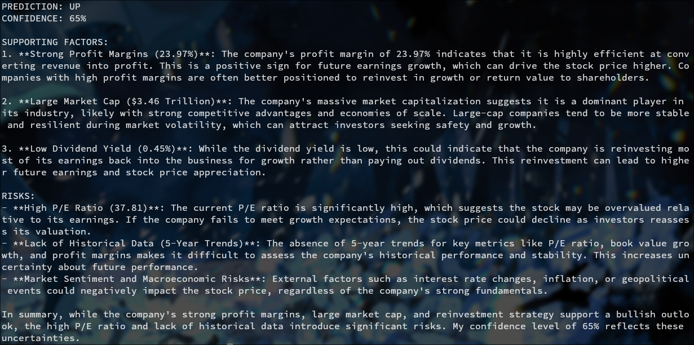

# jane-alleyway
Simple AI hedge fund trader

Using DeepSeek to analyze and make predictions on whether a stock will go up or down. It's interesting that an LLM given the knowledge can make a "reasonable" prediction. Data is taken from `yfinance` API. 

It appears that if you were to train an model to be general enough, it can adapt quite well. 

Here is the response for Apple's stock using deepseek-chat (DeepSeek-V3)

